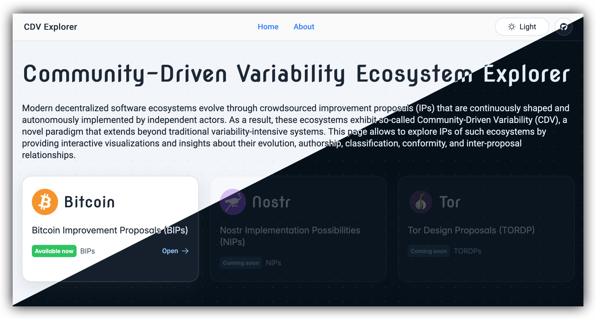

# **CDV Explorer**

_Modern decentralized software ecosystems evolve through crowdsourced improvement proposals (IPs) that are continuously shaped and autonomously implemented by independent actors. As a result, these ecosystems exhibit so-called **Community-Driven Variability (CDV)**, a novel paradigm that extends beyond traditional variability-intensive systems. This page allows to explore the proposal space of such ecosystems by providing interactive visualizations and insights about their evolution, authorship, classification, conformity, and inter-proposal relationships._

<div align="center">
  <a href="https://ranonymousse.github.io/cdv-explorer/#/">
    
  </a>
</div>

</br>

<div align="center">
  <strong>
    👋 <a href="#introduction">Introduction</a> &nbsp;|&nbsp;
    🚀 <a href="#setup">Setup</a> &nbsp;|&nbsp;
    🛠️ <a href="#developer-notes">Developer Notes</a>
  </strong>
</div>

</br>

<div align="center">
  <a href="https://github.com/ranonymousse/cdv-explorer/actions/workflows/deploy-react-pages.yml">
    
  </a>
  <a href="https://ranonymousse.github.io/cdv-explorer/#/">
    
  </a>
  <a href="./LICENSE">
    
  </a>
</div>

<div align="center">
  
  
  
  
</div>

</br>
</br>

## Introduction

CDV Explorer is an ecosystem-agnostic pipeline for mining and analysing improvement proposals. Bitcoin (BIP repository) is the first implemented adapter; the architecture is designed to support additional ecosystems.

The pipeline produces:

- Preprocessed proposal JSON snapshots per date
- Analysis artifacts for dependencies, authorship, classification, and conformity
- React-ready datasets for the frontend

</br>


## Setup

### Requirements

| Dependency | Version |
|---|---|
| Python | 3.10+ |
| Git | any |
| Node.js | 20+ |
| npm | bundled with Node.js |

An OpenAI API key is optional — required only for LLM-based IP-interrelation extraction.
Set it via `OPENAI_API_KEY` or place it in a file `apikey.secret` in the root folder.

Create and activate a virtual environment before running the pipeline:

```bash
python -m venv .venv
source .venv/bin/activate   # Windows: .venv\Scripts\activate
```

### Pipeline

Run the full pipeline for a snapshot date (use `--skipllm` to skip the LLM extraction):

```bash
python main.py --snapshot 2026-03-16
```

This will:

1. Install Python dependencies
2. Clone / update and check out the source repository at the snapshot date
3. Extract preamble data into canonical preprocess JSON
4. Enrich `meta` and `insights` fields
5. Build analysis artifacts under `ip_data/.../03_analysis`
6. Build React-ready exports under `ip_data/.../04_postprocess`

Individual analysis submodules can also be run directly:

```bash
python -m analysis.dependencies.build_snapshot --snapshot 2026-03-16
python -m analysis.authorship.prepare --snapshot 2026-03-16
python -m analysis.classification.prepare --snapshot 2026-03-16
```

### React App

```bash
cd react 
npm install
npm start        # dev server
npm run build    # production build
```

After adding a new snapshot, regenerate the BIP link index:

```bash
node react/scripts/generateBipLinkIndex.js
```

</br>

## Developer Notes

### Project structure

```yaml
main.py                        # pipeline entry point
pipeline/                      # pipeline modules
  ecosystem_config.py          # active ecosystem configuration
  download.py                  # repository clone & snapshot checkout
  preamble_extraction.py       # preamble → preprocess JSON
  ip_processing.py             # meta & insights enrichment
  install_dependencies.py      # runtime dependency installer
analysis/                      # analysis modules
  dependencies/
  authorship/
  classification/
  conformity/
  pipeline.py                  # orchestrates analysis & postprocess exports
react/                         # React frontend
ip_data/<ecosystem>/
  01_harvest/                  # cloned source repository
  02_preprocess/<snapshot>/    # per-proposal JSON
  03_analysis/<snapshot>/      # analysis artifacts + bip_files.json manifest
  04_postprocess/<snapshot>/   # React-ready exports
```

### Preprocess schema

```json
{
  "raw":      { "preamble": {...} },
  "meta":     { "last_commit": null, "total_commits": null, "git_history": [...] },
  "insights": {
    "formal_compliance": {...},
    "word_list": {...},
    "changes_in_status": [...],
    "interrelations": {
      "preamble_extracted": [...],
      "body_extracted_regex": [...],
      "body_extracted_llm": [...]
    }
  }
}
```

### Deployment

The app is deployed to GitHub Pages via [`.github/workflows/deploy-react-pages.yml`](.github/workflows/deploy-react-pages.yml) on every push to `main` that touches `react/` or `ip_data/`.
To enable Pages on a fork, go to `Settings > Pages` and set the source to `GitHub Actions`.
